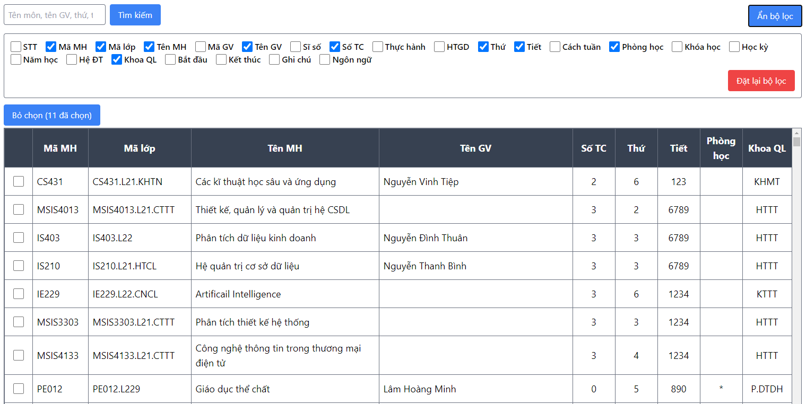
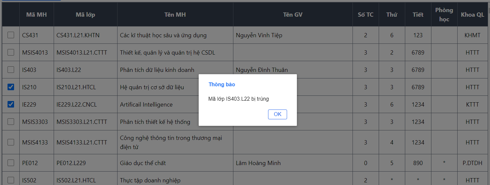
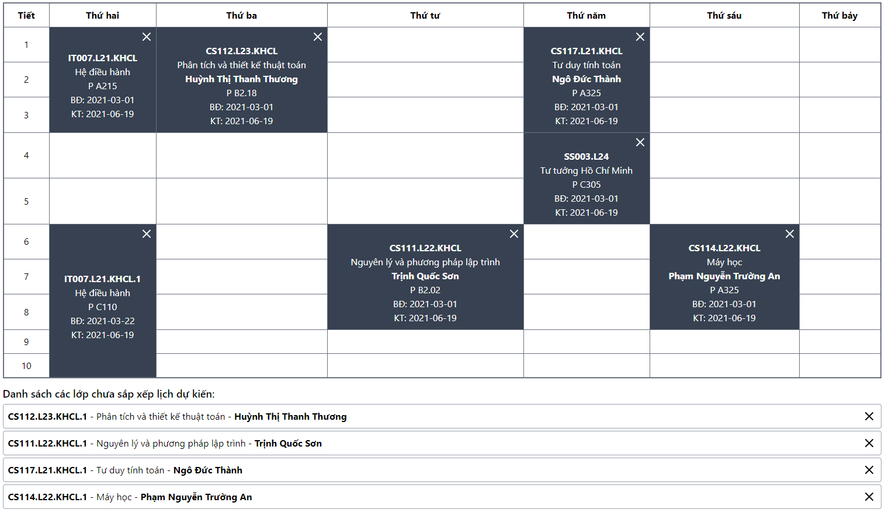
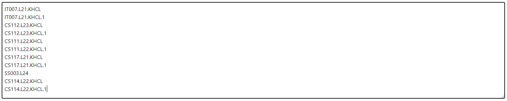
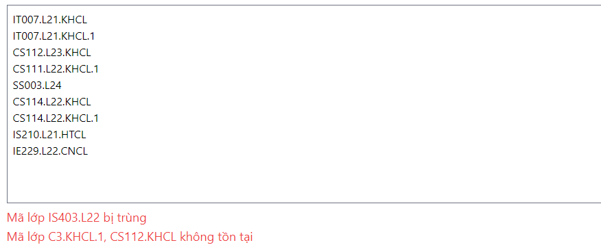

# UIT Schedule 

UIT Schedule là công cụ giúp cho sinh viên UIT có thể dễ dàng chọn và sắp xếp thời khóa biểu của mình cho việc đăng ký học phần.

## Chức năng chính

- Danh sách lớp học dự kiến
  - Chọn lớp bạn muốn học
  - Kiểm tra trùng lịch học
  - Hiển thị bộ lọc
  - Tìm kiếm
- Thời khóa biểu đã chọn
  - Hiện các thông tin cần thiết
  - Cho phép bỏ chọn lớp
- Danh sách các mã lớp đã chọn
  - Hiển thị các mã lớp đã chọn
  - Dễ dàng chọn nhanh bằng cách dán mã lớp

## Screenshots

Hãy cùng xem qua một số giao diện của công cụ này nhé!

### Danh sách các lớp dự kiến cùng bộ lọc và tìm kiếm

Nếu như môn bạn chọn bị trùng lịch thì bạn sẽ nhận được thông báo!

### Thời khóa biểu đã chọn

### Các mã lớp đã chọn

Nếu như các mã lớp mà bạn dán vào không tồn tại hoặc bị trùng lịch thì sẽ được thông báo như thế này:

## Summary

Công cụ còn chưa ổn định do vừa được phát triển, có thể phát sinh lỗi không mong muốn. Hi vọng là mọi người có thể góp ý hoặc open issue để mình phát triển công cụ tốt hơn.

[Contact](https://khiemle.dev/lien-he)
